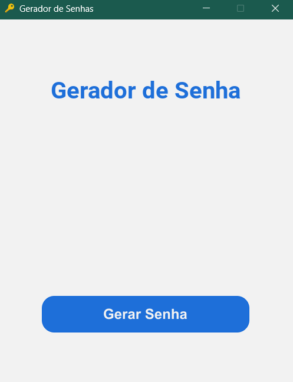
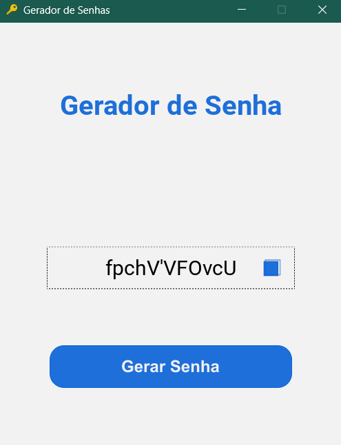

# Gerador de Senhas 🔑

Esse é um projeto feito em Python para geração de senhas de 12 dígitos que incluem letras (maiúsculas e minúsculas), números e alguns símbolos. A interface foi feita com Kivy e empacotada com PyInstaller.

 

## 🖼️ Prints do arquivo executável

Clique para expandir

</img>
</img>

 

## 🚀 Instalação

### Source Code

<ol>
    <li>Faça o download ou clone esse repositório;</li>
    <li>Ative o virtual environment;</li>
    <li>Execute o arquivo main.py (interface) ou password.py (cmd).</li>
</ol>

### Executável

<ol>
    <li>Faça o download do arquivo .zip na aba <a href="https://github.com/ansomething/gerador-de-senhas/releases">Releases</a> e extraia os arquivos;</li>
    <li>Navegue pelas pastas: GeradorDeSenhas → dist → main;</li>
    <li>Por fim, execute o arquivo main.exe.</li>
        <ul>
            <li>⚠️ Atenção: Essa aplicação foi empacotada no sistema operacional Windows x64, logo não é possível a sua execução em outros sistemas.</li>
        </ul>
</ol>

 

## 📝 Licença

Esse projeto está sob licença MIT.
